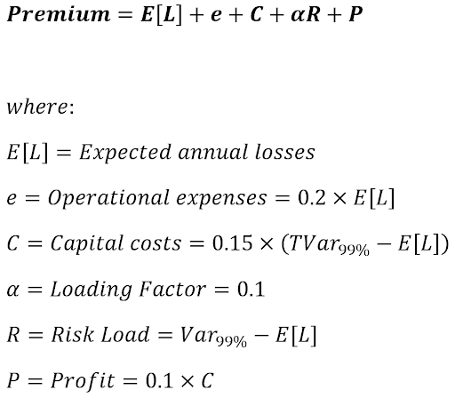
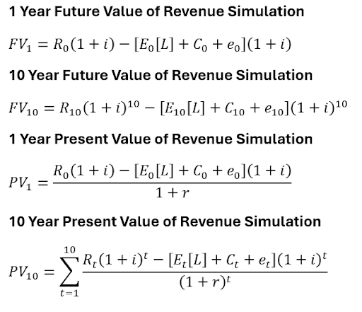
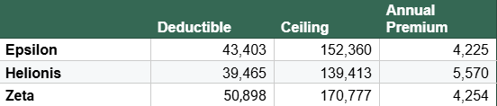
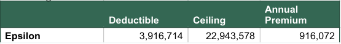
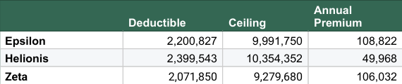
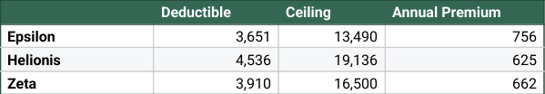
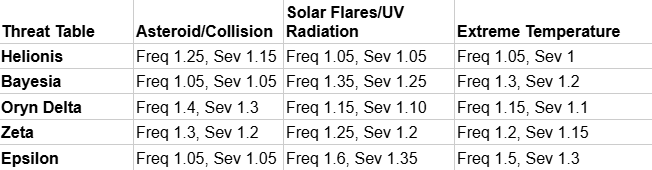
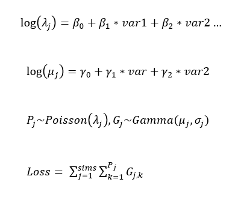

# Actuarial Theory and Practice A - SOA Case Study Report
> By Leo Lee and Maxwell Wu

---

# Report

## Question 1 - Executive Summary

Our product design for Galaxy General Insurance Company (GGIC) consists of a structured premium framework governed by actuarial risk modelling with tailored design features. The premium was based on a frequency-severity approach where expected aggregate losses were calculated along with additional loadings to capture expenses, capital cost, tail risk and target profitability. 

The following equation was used: 

Additional product design features included deductibles and claim limitations to address the distinct risk profiles of each hazard type and solar system. Here, insurers are capable of restricting the loss distribution and placing a ceiling on extreme losses which is especially effective for volatile environments. 

This integrated approach is detailed in Q2, aligning with the GGIC’s risk management framework. The premium calculation effectively identifies and quantifies risk profiles where claim frequency and severity that is characteristic of the solar system is accounted for. Risk exposure is then managed through deductibles and price ceilings which are calculated based on environmental characteristics to ensure that variable costs are controlled. From a capital management perspective, monetary initiatives against extreme losses were accounted for by pre-emptively offsetting capital allocation through the premium calculation. To support the deployment of the product, scenario analysis for evolving conditions such as solar flares and extreme heat have been provided, ensuring that the ERM framework is adaptable and dynamic against a broad range of situations. 

## Question 2 - Product Design
Our insurance policies have an overall structure comprising a deductible equivalent to 50% of the average claim severity for each solar system, and a ceiling equal to the 90th percentile of the claim severities for that system, which ensures that they are representative of their respective solar systems. Any claims over the ceiling in magnitude will only incur a payout of this ceiling value, while any claims under the deductible threshold will not be paid out by the insurer, but are instead paid out by the policy holder. If in between, the payout is equivalent to the claim amount, less the deductible, which the policy holder covers. The average loss per policyholder was found by dividing the mean aggregate loss by the number of unique policyholders in each solar system, with the results shown in appendix. 

Each risk scenario was assigned a weight, based on their likelihood. The baseline scenario was assigned a weight of  98%, while extreme heat was 1.5%, and solar flares were given a weighting of 0.5%. The annual premium for each policy was determined by adding the expected losses, capital expense, risk loading factors and required profit margin (equivalent to 10% of capital expenses). It was then applied to a 10-year annuity, with interest and inflation rates being found by averaging the last 5 years of provided rates, using the following formula: 

### Equipment Failure: 

The product demonstrates a deductible and ceiling offering tailored to the characteristics of each solar system with Zeta having the biggest absolute values, reflecting its high severity risk profile which is vulnerable to large, infrequent claims. Projecting across a 10 year period [L fig. 2], there is substantial growth in both aggregate returns and costs. However, profit is retained across all solar systems and even under extreme scenarios (1-in-100), emphasising the importance of dynamic pricing design which ensures sustainability among both expected conditions and tail exposure. For example, Helionis’ aggregate loss distribution is much wider [L fig.4] indicating high volatility in claim loss despite coverage limitations. However, the resilient product design accounts for this by calibrating annual premium loadings (risk and capital), ensuring that profitability is sustained under high-risk cases. 

### Cargo Loss: 

The cargo loss product is designed at a larger scale with deductibles and ceilings reflecting the severity-driven nature of cargo incidents. By centralising coverage between these thresholds, there is minimised exposure to extreme cargo accidents and smaller, attritional losses. Observing the aggregate loss distribution [L fig.5], high risk scenarios tend to widen and shift the distribution rightward. This indicates an exposure to significant tail risk exposure and increased volatility in claim outcomes. To mitigate this, additional capital cost (0.3 mult) and risk loading (0.4 mult) were incorporated into premium calculations to ensure adequate pricing in both expected and 1-in-100 scenarios. Across a 10-year horizon, despite high variances in costs, extreme risk scenarios were managed via dynamic premium calculations where pre-emptive capital allocation enabled sufficient compensation for tail risk [L fig.3].

### Business Interruption:

The deductible and ceiling values are comparable, indicating similar circumstances between all solar systems. The Helionis system had the highest deductible, which helps to lower premiums, by reducing the losses faced by the insurer, and serves as an indicator that the Helionis system does not encounter many smaller claims, but is susceptible to events of a greater magnitude occurring. The stable weather and solar flare environment of the Helionis system is a key contributor to this, reducing the overall danger present to mining stations. However, the disturbance and unpredictability of asteroids and gravitational currents within the system can cause significant damage to satellites or infrastructure, prompting the necessity of a higher claim ceiling, to cover more extreme damage. 

Appendix [M fig.1] shows that the Helionis system had the lowest returns and costs comparatively over a 10 year period, being approximately 50% of its counterpart solar systems. This could indicate that the Helionis system represents little risk from an insurer perspective. Epsilon and Zeta had relatively lower standard deviations of cost and revenue relative to their actual values, and could be more attractive locations to focus future insurance expansion on. 

### Workers’ Compensation: 

The Helionis system had the highest deductible and ceiling, further showing its susceptibility to more severe events. The Epsilon system had the lowest deductible and ceiling, indicating an overall lower severity in the work compensation claims filed within that system, attributable to enhanced safety training and more rigorous safety protocols, due to its toxic atmosphere and climate. 
[M fig.2] shows that, in the long term, all 3 solar systems generate highly comparable returns, costs and net revenue. Helionis still exhibits the lowest cost, returns and net revenue, reflecting a general lower demand in comparison to other systems. However, [M fig.2] reveals that, despite this, Helionis has the highest 99th percentile revenue out of all solar systems, reinforcing its status as a system where claims are not frequent, but are typically of high severity when they do occur. 

## Question 3 - Summary of Pricing and Capital Modelling

## Question 4 - Risk Assessment

Scenario testing was undertaken by constructing models for both claim frequency and severity. A Poisson model was chosen for frequency, and a Gamma model was chosen for severity. A vector of parameters was obtained for each model by creating predictions using frequency data, as it had a more comprehensive account of all policies in place. 100 simulations were then run, with the Poisson model using rPois to generate a claim count, which was then used by the Gamma model to generate a series of claim severities, contributing to the total aggregate loss. The mathematical reasoning behind this workflow can be seen in the following equations: 

The multipliers in the table above were applied separately to  in the Poisson model, and  in the Gamma model, to mimic the effects of extraordinary environmental variables on aggregate loss. For example, the Helionis cluster did not experience any volatile solar activity, and was therefore given the lowest multipliers for solar flares, as it meant that solar flares would be unlikely to affect business operations.

For a baseline scenario, no multipliers were used, to mimic a system where there were no accidents. Solar flare activity was deemed to be the highest risk scenario due to the potential damage it could cause within the different hazard areas, along with its strong presence in all 3 systems. The middle risk scenario was extreme heat, which holds less immediate danger than solar flares, but is still capable of accentuating hazard areas and causing complications. 

## Question 5 - Assumptions
* The distribution of claim counts was assumed to follow a Poisson distribution, while claim severity was assumed to follow a Gamma distribution. This was done to make data simulation possible, in order to explore the ramifications of each risk scenario, but this assumption did not always hold up, and alternate distributions had to be used to fit the data.

* The effects of different risk scenarios on loss within solar systems were quantified through the usage of multipliers, which were determined through the analysis of the online encyclopaedia, to determine the effect of certain scenarios on frequency and severity in a solar system
* Due to the lack of future interest and inflation rates, an assumed rate was devised by taking the average of the past 5 rates, to create a stable estimate
* Obtaining formulae for capital costs, risk loading and operational expenses required careful consideration with regards to choosing a coefficient that would prevent the variable from having an excessive impact on the premium, while being feasible in real life
* The profit margin of 10% was attained through external research using a vehicle insurance provider (greenslips.com.au), which provided real world evidence of a 10% profit margin being a reasonable and fair aim. 

## Question 6 - Data Limitations
A significant limitation of the data was the existence of poor quality variable names and values. For example, some claim counts in the business interruption dataset were negative, which made modelling using Poisson and Gamma GLMs impossible. These values had to be removed before any work or modelling started. Additionally, there was the existence of variable names with ‘garbage’ values, such as ‘Zeta?????_’, that would show up as extra factor levels in GLM models, warping the coefficients and creating difficult, lengthy summary sheets. These values were dealt with by preprocessing the data to only include variable values that had full names, uniform names. 

Additionally, there was a constant presence of statistical outliers in claim_count and claim_amount that created problems with GLM models converging. This was rectified by imposing artificial ‘caps’ on data, to remove some outliers that were having an enormous impact on the data. A similar problem was seen when using these GLMs to form predictions on data, and was handled the same way. 

AI was utilised to support the validation of modelling approaches (Poisson, Gamma, e.t.c), where assumptions and outputs were cross checked with industrial actuarial practices. This included assessing the consistency of model outputs and the reasonableness of our product design including premium levels, ensuring that proposed pricing structures aligned with realistic offerings within the market. 

